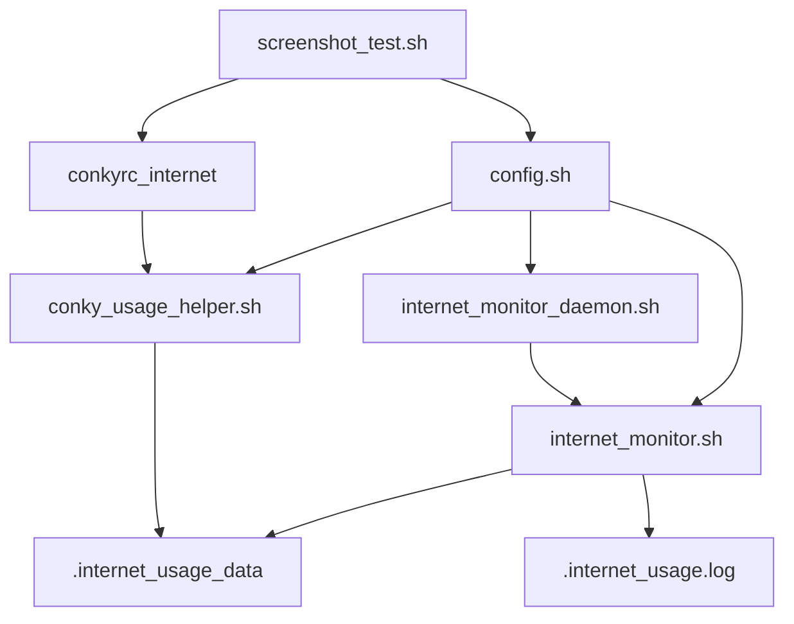

# Internet Usage Monitor - Project Structure

## 📁 **New Organized Structure**

```
internet-usage-monitor/
├── 📁 src/                           # Source code files
│   ├── 🔧 internet_monitor.sh        # Main monitoring script (runs once)
│   ├── 🔄 internet_monitor_daemon.sh # Daemon script (continuous monitoring)
│   └── 📊 conky_usage_helper.sh      # Helper script for Conky widget
│
├── 📁 config/                        # Configuration files
│   ├── ⚙️ config.sh                  # Shared configuration
│   └── 🎨 conkyrc_internet          # Conky widget configuration
│
├── 📁 scripts/                       # Utility scripts
│   └── 📸 screenshot_test.sh         # Testing script for screenshots
│
├── 📁 docs/                          # Documentation
│   ├── 📋 PROJECT_STRUCTURE.md       # This file
│   └── 📝 IMPROVEMENTS.md            # Recent improvements documentation
│
├── 📁 screenshots/                   # Screenshots directory (empty)
│
├── 🚀 install.sh                     # Installation script
├── 🗑️ uninstall.sh                   # Uninstallation script
├── 📄 README.md                      # Main documentation
├── 📜 LICENSE                        # MIT License
└── 🚫 .gitignore                     # Git ignore rules
```

## 🎯 **Benefits of New Structure**

### ✅ **Organized & Clean**

- Related files grouped together
- Clear separation of concerns
- Root directory not cluttered

### ✅ **Easy to Navigate**

- `src/` - All executable scripts
- `config/` - All configuration files
- `scripts/` - Utility and testing scripts
- `docs/` - All documentation

### ✅ **Professional Structure**

- Follows standard project conventions
- Scalable for future additions
- Clear for contributors

## 🔧 **File Descriptions**

### **Source Files (`src/`)**

#### `internet_monitor.sh`

- **Purpose**: Main monitoring logic
- **Execution**: Runs once and exits
- **Use case**: Perfect for cron jobs
- **Features**:
  - Network usage tracking
  - Threshold notifications (80% warning, 100% critical)
  - Command-line interface for testing

#### `internet_monitor_daemon.sh`

- **Purpose**: Continuous monitoring wrapper
- **Execution**: Runs indefinitely with sleep intervals
- **Use case**: Manual daemon mode
- **Features**:
  - PID file management
  - Clean shutdown handling
  - Calls main script in loop

#### `conky_usage_helper.sh`

- **Purpose**: Data extraction for Conky widget
- **Execution**: Called by Conky to get formatted data
- **Use case**: Widget display data source
- **Features**:
  - Multiple output formats (GB, MB, percentages)
  - Status detection
  - Configuration reading

### **Configuration Files (`config/`)**

#### `config.sh`

- **Purpose**: Centralized configuration
- **Contains**: All tunable settings
- **Benefits**: Single source of truth
- **Settings**:
  - Daily data limit
  - Warning/critical thresholds
  - Network interface settings
  - Notification preferences

#### `conkyrc_internet`

- **Purpose**: Conky widget configuration
- **Contains**: Widget appearance and layout
- **Features**:
  - Modern styling
  - Color-coded status display
  - Dynamic threshold display

### **Utility Scripts (`scripts/`)**

#### `screenshot_test.sh`

- **Purpose**: Testing different usage scenarios
- **Use case**: Preparing screenshots
- **Features**:
  - Interactive menu system
  - Test data generation
  - Conky management
  - Data backup/restore

### **Installation Scripts (Root)**

#### `install.sh`

- **Purpose**: Automated installation
- **Features**:
  - Dependency checking
  - File copying
  - Autostart setup
  - Distribution detection

#### `uninstall.sh`

- **Purpose**: Complete removal
- **Features**:
  - Data backup before removal
  - Process stopping
  - Service cleanup
  - Confirmation prompts

## 🔗 **Path References**

### **After Installation**

When installed, files are copied to:

```
$HOME/
├── internet_monitor.sh          # Main script
├── internet_monitor_daemon.sh   # Daemon script
├── conky_usage_helper.sh        # Helper script
├── config.sh                    # Configuration
└── .conkyrc_internet           # Conky config
```

### **Runtime Data Files**

```
$HOME/
├── .internet_usage_data         # Usage tracking data
└── .internet_usage.log         # Activity log
```

## 🔄 **Script Interdependencies**



## 📝 **Usage Examples**

### **Development/Testing**

```bash
# From project directory:
src/internet_monitor.sh usage           # Check status
scripts/screenshot_test.sh              # Test scenarios
```

### **After Installation**

```bash
# From home directory:
~/internet_monitor.sh usage             # Check status
~/internet_monitor_daemon.sh &          # Start daemon
```

### **Configuration Changes**

```bash
# Edit centralized config:
nano config/config.sh                   # In project
nano ~/config.sh                        # After installation
```

## 🚀 **Migration from Old Structure**

The `install.sh` script handles:

- ✅ Automatic detection of new folder structure
- ✅ Proper path resolution for all scripts
- ✅ Configuration file copying
- ✅ Executable permissions

The `uninstall.sh` script handles:

- ✅ Removal of both old and new version files
- ✅ Data backup before removal
- ✅ Service cleanup (cron, systemd, autostart)
- ✅ Process termination

## 🎯 **Future Expansion**

This structure allows for easy addition of:

- `tests/` - Automated testing scripts
- `examples/` - Configuration examples
- `contrib/` - Community contributions
- `locale/` - Internationalization files

The organized structure makes the project more maintainable and professional while keeping all functionality intact.
